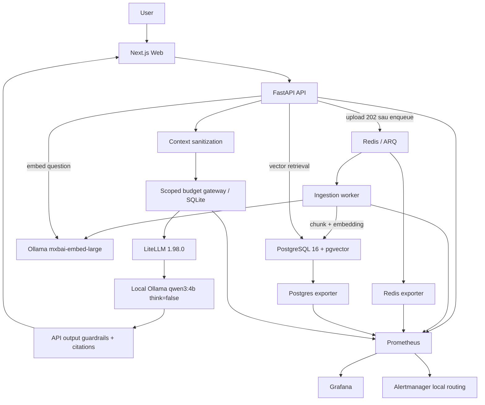

# Kiến trúc cuối của InsightHub

Đây là **LOCAL RUNTIME**, chạy Docker Desktop Kubernetes trên một máy học tập;
không phải AWS production. Trạng thái ngày 2026-10-04: node Ready, các pod ứng
dụng/monitoring ready; [inventory](evidence/day7-inventory.json) chứa image,
restart count, branch và HEAD thực tế. Không triển khai lại infrastructure Day 7.

Web/API/worker/Redis chạy trong namespace `insighthub-dev`; PostgreSQL là
StatefulSet với storage local. `monitoring` chứa kube-prometheus-stack,
Grafana, Prometheus và Alertmanager. API image hiện tại là
`insighthub-api:day6-security-r2-local`; worker `day4-final`, web `day3`.
Readiness hiện tại không chứng minh không có lỗi trong lịch sử: worker có
40 restart tại inventory, web có 22; cần xem thời điểm và nguyên nhân trước
khi đánh giá độ ổn định production.

Ollama chạy trên Windows host; model generation qwen3:4b và embedding
mxbai-embed-large có chức năng khác nhau. Không đổi embedding identity/index.
Hai container FinOps dùng image LiteLLM pinned 1.98.0: proxy và gateway admission
(kiểm soát tiếp nhận request). Kubernetes Service/EndpointSlice nối API đến
gateway trên Docker network local. Đây là endpoint phụ thuộc IP container,
không phải controller tự động phục hồi discovery.

Thứ tự FinOps thực tế: workload → scoped identity/budget gateway → LiteLLM →
Ollama. API dùng giao thức OpenAI-compatible (`provider=openai`) để gọi local
gateway; điều này không có nghĩa gọi OpenAI cloud. Ba workload InsightHub,
Bot, Coding có identity riêng; credentials chỉ ở runtime local/Secret, không
đưa vào tài liệu. Xem [FinOps](final-finops-status.md).

Security kiểm tra request trước retrieval, làm sạch context và tên nguồn,
kiểm tra output trước chuẩn hóa citation. Các heuristic (quy tắc nhận diện)
giảm injection/PII/excessive agency và phát hiện protected-policy overlap;
không chứng minh phòng thủ tuyệt đối. Không công bố nội dung SYSTEM_PROMPT.
[Final security](final-security-status.md) giữ nguyên 66 PASS / 2 FAIL / 2 ERROR.

ChatOps Day 5 dùng signed events, Redis durable queue, deduplication và approval
binding; read-only MCP và identity mutation hạn chế được tách riêng. Controlled
scale/restore chỉ có bằng chứng lịch sử; không chạy mutation trong Day 7.
Live Slack integration chưa hoàn tất. MCP không nằm trên đường RAG generation.

Kubernetes API transport hiện dùng relay loopback 16443 với kubeconfig ngoài
repo; giữ TLS validation. Relay Docker báo unhealthy nhưng truy vấn kubectl
thành công; đây là workaround phục hồi tạm thời, cần xử lý riêng trong tương lai.
Không ghi kubeconfig/token vào evidence. Terraform/cloud chỉ static validation.

Nguồn: [Day 1 async](day1-async-ingestion.md), [flow](end-to-end-flow.md),
[matrix](final-test-matrix.md), [limitations](project-limitations.md).
